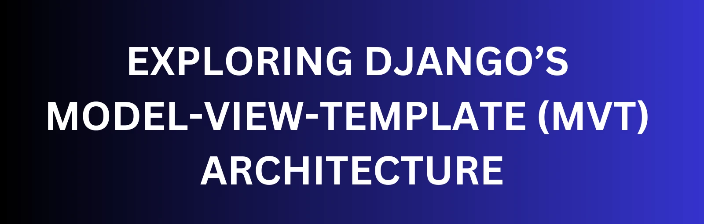

# Come funziona l'Architettura MVT di Django. Models, Views, e Templates

di Davide Facciolo

LICENSE MIT



Django è un framework Python di alto livello. È popolare per la sua semplicità ed efficienza nella costruzione di applicazioni web robuste.

Al centro dell'architettura di Django c'è il pattern Model-View-Template (MVT). Avere una buona comprensione di come i Modelli, le Viste e i Template interagiscono è cruciale se vuoi sfruttare appieno la potenza di Django.

Che tu sia completamente nuovo in Django o un principiante, questo articolo servirà come una guida completa che ti mostrerà come questi componenti funzionano e interagiscono tra loro per creare applicazioni web dinamiche.

Per renderlo ancora più comprensibile, costruiremo una semplice applicazione per aiutarti a capire meglio l'interconnessione di questi componenti.

Se sei già entusiasta, entriamo subito nel vivo!

Ecco cosa tratteremo:

- Prerequisiti
- Cos'è l'Artichettura MVT?
- Il Componente Model
- Il Componente View
- Il Componente Template
- DAB Per il flusso dell'MVT
- Real World Case
- Mettere tutto insieme in un progetto
- Conclusioni

## Prerequisiti

Per continuare devi avere:
*Conoscenza base di come funzionano le applicazioni web, compresa l'architettura client-server.*

*Conoscenza base di python*

**Opzionale** *Conoscenze di sviluppo frontend*

## Cosa è l'Architettura MVT

Il pattern MVT è l'approccio di Django per organizzare il codice e il flusso di lavoro di un'applicazione web. I componenti che costituiscono questa architettura sono il Modello, la Vista e il Template. Ogni componente esegue funzioni specifiche e poi passa il processo agli altri componenti per eseguire le proprie.

Diamo un'occhiata veloce ai componenti con le funzioni specifiche che svolgono:

**Modello**: Conosciuto anche come il livello dei dati, gestisce i dati e interagisce con il database.

**Vista**: Conosciuta anche come il livello della logica, agisce da intermediario, gestisce la logica e il flusso dei dati.

**Template**: Conosciuto anche come il livello di presentazione, rende il contenuto HTML sull'interfaccia utente.

Ora che hai un idea sui componenti e i loro ruoli in un applicazione Django, vediamo *come* fanno ad interagire nell'architettura.

### Il Componente Model

I modelli gestiscono la struttura e l'interazione dei dati in un'applicazione Django, rendendoli le fondamenta della stessa per via del ruolo che i *dati* giocano.

#### Struttura generale di un Modello Django

In Django, ogni Modello segue una particolare forma di dichiarazione.

Ecco la struttura base di una classe da usare come Modello:

class <model_name>(models.Model):
    <field_name> = models.<field_type>(<optional_field_characteristics>)

Vediamo cosa sono:

**class**: la parola chiave usata per definire una classe in python.

**model_name**: il nome del Model.

**models.Model**: la classe base dalla quale il Modello eredità i campi e i metodi. Questa fa in modo che la classe Obiettivo si comporti a tutti gli effetti da Model.

**field_name**: il nome del campo nel database.

**field_type**: si riferisce al tipo di dato che il campo contiene, tipo charField, inttegetField, booleanField etc.

**optional_field_characteristics**: usati per definire come si comporta il campo, max_length, default, etc.

### Esemio di Model

Ora che sai tutto quello che serve sui modelli per il momentom costruiamone uno per una lista di Obiettivi.

I campi che contiene solitamente sono un nome, una descrizione e un indicatore per verificare se l'Obiettivo è completato o no.

```python
class Obiettivo(models.Model):
    nome = models.CharField(max_length=100)
    descrizione = models.TextField()
    completato = models.BooleanField(default=False)
```

#### In questo Model

Obiettivo èil nome del Modello

Il modello Obiettivo ha 3 campi:

- nome: Un campo che contiena testo, con una lunghezza massima fino a 250 caratteri.

- descrizione: Un campo testo con più capacità di storage.

- completato: Un valore Booleano (quindi valori True o False), con un default a False (Chiuso).

## Il Componente View

Le View in Django sono responsabili di processare le richieste dell'utente e ritornare una risposta.

Agiscono come ponte di collegamento tra i Modelli e i Template, raccogliendo dati dagli oggetti Model, eseguendo operazioni logiche su di essi (per esempio interrogazioni in base a specifici criteri), e passano i risultati ai template per essere visualizzati.

Le Viste possono essere scritte sia come funzioni che come classi, a seconda della complessità e dei requisiti dell'applicazione.

## Struttura generale di una View in Django

Ecco la struttura base di una Vista in Django.

```python
def <view_name>(request):
    # La logica della View va qui...
    return render(request, <template>, <context>)
```
